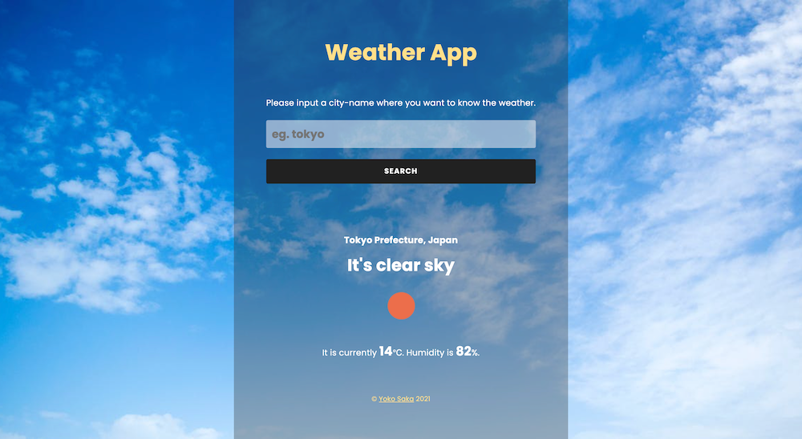

# Weather App

## About the Project

This project is based on the [Odin project: Weather App](https://www.theodinproject.com/courses/javascript/lessons/weather-app). I used [Weather API](https://openweathermap.org/api) to take and show weather information based on the location data taking from [MapBox API](https://docs.mapbox.com/api/overview/). Also, the background image, which is provided by [Pexels API](https://www.pexels.com/api/documentation/), is changed randomly corresponding to the weather of the location you've searched.

A list of commonly used resources that I find helpful is listed in the acknowledgments.

## Table of Contents

* [About the Project](#about-the-project)
* [Built With](#built-with)
* [Live Demo](#live-demo)
* [Getting Started](#getting-started)
* [Author](#author)
* [Contributing](#contributing)
* [Show your support](#show-your-support)
* [License](#license)
* [Acknowledgements](#acknowledgements)

## Built With

* [HTML5](https://en.wikipedia.org/wiki/HTML5)
* [SASS(SCSS)](https://sass-lang.com/)
* [JavaScript](https://en.wikipedia.org/wiki/JavaScript)

## Live Demo

[Live Demo Link](https://yocosaka.github.io)

## Getting Started

To get a local copy up and running follow these simple example steps.

1. On the project GitHub page, navigate to the main page of the repository.
2. Under the repository name, locate and click on a green button named `Code`. 
3. Copy the project URL as displayed.
4. If you're running the Windows Operating System, open your command prompt. On Linux, Open your terminal. 
5. Change the current working directory to the location where you want the cloned directory to be made. Leave as it is if the current location is where you want the project to be. 
6. Type git clone, and then paste the URL you copied in Step 3.  
e.g. $ git clone https://github.com/yourUsername/yourProjectName 
7. Press Enter. Your local copy will be created. 
8. In the console, go to the place where you cloned this folder, and run `npm install`
9. Go to each API's website and create your free account to get token/key/id
  - [Weather API](https://openweathermap.org/api)
  - [MapBox API](https://docs.mapbox.com/api/overview/)
  - [Pexels API](https://www.pexels.com/api/documentation/)
10. create .env file in the top level of the directory, and write your token/key/id like below:
`MAPBOX_ACCESS_TOKEN=<YOURTOKENHERE>
WEATHER_APP_ID=<YOURTOKENHERE>
PEXELS_API_KEY=<YOURTOKENHERE>`
11. Run `npm run dev`, then the server will be opened

## Author

👤 **Yoko Saka**

- GitHub: [@yocosaka](https://github.com/yocosaka)
- Twitter: [@yocosaka](https://twitter.com/yocosaka)
- LinkedIn: [Yoko Saka](https://www.linkedin.com/in/yokosaka)

## Contributing

Contributions, issues, and feature requests are welcome!
Feel free to check the [issues page](../../issues).

1. Fork the Project
2. Create your Feature Branch (`git checkout -b feature/AmazingFeature`)
3. Commit your Changes (`git commit -m 'Add some AmazingFeature'`)
4. Push to the Branch (`git push origin feature/AmazingFeature`)
5. Open a Pull Request

## Show your support

Give a ⭐️ if you like this project!

## License

This project is [MIT](./LICENSE) licensed.

## Acknowledgements
- [Odin project: Weather App](https://www.theodinproject.com/courses/javascript/lessons/weather-app)
- [Weather API](https://openweathermap.org/api)
- [MapBox API](https://docs.mapbox.com/api/overview/)
- [Pexels API](https://www.pexels.com/api/documentation/)
